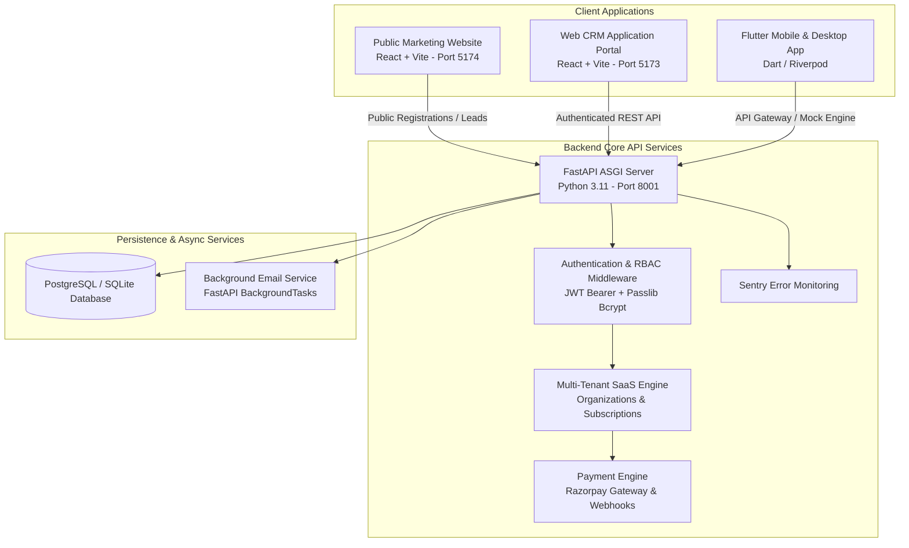

# 🏢 REALVION – Master Real Estate CRM & SaaS Platform Documentation

> **Version**: 2.5.0  
> **Architecture**: Multi-Tenant Decoupled Monorepo Ecosystem (FastAPI Backend + React Vite CRM Portal + React Vite Marketing Site + Flutter App + Playwright QA Test Suite)  
> **Deployment**: Render Blueprint (`render.yaml`), Docker & PostgreSQL Ready  
> **Last Updated**: August 2026  

---

## 📖 Executive Summary

**REALVION** is an enterprise-grade, high-performance SaaS platform built specifically for real estate developers, agencies, channel partners (CP), and sales teams. It unifies lead pipelines, property bookings, broker commission payouts, sales targets, dynamic marketing inquiries, instant demo sandboxes, and real-time audio/voice client follow-ups into a unified multi-tenant operating system.

### Key Highlights
- **Multi-Tenant SaaS Architecture**: Built-in support for Organizations, Workspaces, Subscription Plans (Starter, Professional, Enterprise), and seat/lead quotas.
- **1-Hour Sandbox Demo Engine**: Instant workspace auto-provisioning with pre-seeded demo data, active lead pipelines, projects, and automated expiration timers.
- **Razorpay Payments & Webhooks**: Integrated payment gateway supporting order creation, signature verification, coupon discounts (`REALVION20`), and automated subscription lifecycle management.
- **Audio & Voice Alarm System**: Web Audio API dual-harmonic chime combined with Web Speech API text-to-speech voice announcements for pending tasks.
- **Role-Based Access Control (RBAC)**: 5 distinct roles (Super Admin / Platform Owner, Tenant Admin, Manager, Sales Executive, Broker Channel Partner).
- **Automated QA & E2E Test Suite**: 12 comprehensive Playwright test specs validating tenant isolation, security boundaries, payment flows, and responsive UI viewports.

---

## 🏗️ Ecosystem Architecture



---

## 🛠️ Technology Stack & Platform Modules

### 1. **Public Marketing Website (`web_based_crm/website`)**
* **Framework**: React 18 with TypeScript & Vite
* **Styling**: Tailwind CSS Tokens, Modern Dark Aesthetic (`#090D16`, `#C8A45D` Gold Accents)
* **UI Components**: Framer Motion (Page Transitions & Modals), Lucide React (Icons)
* **Pages & Features**:
  * `/` – **HomePage**: Hero presentation, key features, pricing preview, interactive demo request.
  * `/solutions` – **SolutionsPage**: Tailored real estate agency & developer workflows.
  * `/features` – **FeaturesPage**: Dynamic feature catalog & technology deep-dives.
  * `/pricing` – **PricingPage**: Interactive SaaS pricing matrix with billing toggles & coupon input.
  * `/register` – **RegisterPage**: Multi-step tenant onboarding & instant 1-hour demo registration.
  * `/industries` – **IndustriesPage**: Residential, commercial, and land developer use cases.
  * `/about` – **AboutPage**: Corporate story, vision, and technology stack.
  * `/blog` – **BlogPage**: Market insights & real estate sales strategies.
  * `/faq` – **FaqPage**: System capabilities, security, and onboarding FAQ.
  * `/contact` – **ContactPage**: Contact form, sales inquiries, and support routing.

### 2. **Web CRM Application Portal (`web_based_crm/frontend`)**
* **Framework**: React 18 with TypeScript & Vite
* **Styling**: Custom Glassmorphism CSS Design System (`index.css`), Dark/Gold Theme Palette
* **UI Components**: TanStack Table v8 (Data Grids, Pagination & Filtering), Framer Motion (Drawers & Modals), Lucide React
* **Audio & Speech Synthesizer**:
  * **Web Audio API**: Dual-harmonic sine-wave chime synthesizer ($C_5 \rightarrow E_5 \rightarrow G_5 \rightarrow C_6$).
  * **Web Speech API**: Native text-to-speech voice synthesizer for spoken reminder alerts.
* **HTTP Client**: Axios with JWT Request/Response Interceptors, Auto-Refresh Tokens, and Dynamic Hostname Production Fallback.

### 3. **Backend API Architecture (`web_based_crm/backend`)**
* **Framework**: Python 3.11 + FastAPI (Asynchronous ASGI Framework)
* **ORM & Database**: SQLAlchemy 2.0 ORM with SQLite (Local) & PostgreSQL (Production) Support
* **Migrations**: Alembic DB Migration Framework
* **Security & Auth**: OAuth2 Bearer Tokens, PyJWT Encoding, Passlib Bcrypt Hashing
* **Error Tracking**: Sentry SDK Integration with dedicated debug endpoints
* **Payment Gateway**: Razorpay SDK & Webhook Signature Verification (`HMAC-SHA256`)

### 4. **QA Automation Test Suite (`web_based_crm/qa-tests`)**
* **Framework**: Playwright TS
* **Coverage**: 12 automated E2E test specification files covering DOM crawling, payment verification, session security, tenant isolation, and responsive layout integrity.

---

## 🔐 Role-Based Access Control (RBAC)

Public self-registration creates either a **Free 1-Hour Sandbox Demo** or a **Paid Agency Organization**. Admin accounts manage their respective tenant scope, while Super Admin exercises global platform oversight.

| Role | Portal URL | Access Scope & Capabilities |
| :--- | :--- | :--- |
| **Super Admin** (`Super Admin`) | `/admin/saas` | **Platform Owner**: System analytics (MRR, ARR, MoM Growth), list all organizations, create offline tenants, modify seat/lead quotas, extend subscriptions. |
| **Tenant Admin** (`Admin`) | `/admin/dashboard` | **Agency Owner**: Full tenant control, manage sales team, assign revenue targets, configure projects/builders, track commissions & bookings. |
| **Manager** (`Manager`) | `/admin/dashboard` | **Team Lead**: Oversight of sales team, inventory catalogs, lead pipeline analytics, and follow-up agendas. |
| **Sales Executive** (`Sales Executive`) | `/sales/dashboard` | **Sales Agent**: Persona-scoped access. Manage assigned leads, schedule follow-ups, log notes, track monthly targets and bookings. |
| **Broker Partner** (`Broker`) | `/sales/dashboard` | **Channel Partner**: View available projects, register client leads, track closed deals, and view commission payouts. |

---

## 🌟 Key Functional Modules

### 1. 🔔 Real-Time Voice & Audio Chime Reminder System
* **Automated Alarm Trigger**: Periodic check every 8 seconds for upcoming/overdue tasks.
* **Audio Chime & Spoken Alert**: Plays a 4-note musical chime followed by text-to-speech notification (*"Reminder Alert! You have a scheduled [Call / Site Visit] with [Lead Name]"*).
* **Role Scoping**: Executives receive alerts strictly for assigned tasks; Admins receive alerts for self-scheduled tasks.
* **Quick Actions**: 1-tap **Call Lead** (`tel:...`), **Snooze 15 Min**, and **Mark Completed**.

### 2. 🚀 SaaS Multi-Tenancy & Razorpay Payments
* **Subscription Plans**:
  * `Starter`: ₹999/mo (5 Users, 1,000 Leads)
  * `Professional`: ₹4,999/mo (15 Users, 5,000 Leads)
  * `Enterprise`: ₹14,999/mo (50 Users, 25,000 Leads)
* **Instant 1-Hour Demo**: OTP verification via email (`app/services/email_service.py`), creates isolated sandbox workspace with seeded leads, builders, and projects. Auto-expires after 60 minutes.
* **Razorpay Payment Gateway**: Supports order creation, HMAC-SHA256 signature verification, webhook processing, and automatic license generation.

### 3. 🎯 Sales Team Target & Performance Engine
* **Target Normalization**: Dynamically computes deal count and revenue totals in Lakhs (INR).
* **Auto Target Provisioning**: Automatically initializes monthly `SalesTarget` records upon user creation.
* **Real-time Performance Leaderboard**: Aggregates target progress across team members.

### 4. 🏢 Projects & Builder Catalog
* **Inline Developer Creation**: Register new builders on-the-fly (`new_builder_name`) directly inside project creation.
* **Rich Specifications**: Min/Max Price (in Lakhs), RERA ID, Construction Status (`Under Construction`, `Ready to Move`, `New Launch`), PDF Brochure links, and Amenity badges.

### 5. 📞 Dynamic Lead Pipeline & Live Notes Drawer
* **7-Stage Workflow**: `New` $\rightarrow$ `Contacted` $\rightarrow$ `Qualified` $\rightarrow$ `Site Visit Scheduled` $\rightarrow$ `Negotiation` $\rightarrow$ `Booked` $\rightarrow$ `Lost`.
* **Real-Time Drawer**: Instant activity log note synchronization across active user sessions.

---

## 🗄️ Database Schema & Data Models

```
┌─────────────────┐       ┌─────────────────┐       ┌─────────────────┐
│  Organization   │1     *│    Workspace    │1     *│      User       │
├─────────────────┤───────├─────────────────┤───────├─────────────────┤
│ id (PK)         │       │ id (PK)         │       │ id (PK)         │
│ name, slug      │       │ organization_id │       │ name, email     │
│ gst_number      │       │ is_demo         │       │ role, password  │
└─────────────────┘       └─────────────────┘       └─────────────────┘
         │1                        │                         │1
         │                         │                         │
         │1                        │                         │*
┌─────────────────┐                │                ┌─────────────────┐
│  Subscription   │                │                │      Lead       │
├─────────────────┤                │                ├─────────────────┤
│ plan_code       │                │                │ name, phone     │
│ status, end_date│                │                │ status, budget  │
└─────────────────┘                │                └─────────────────┘
                                   │                         │1
                                   │                         │
                                   │                         │*
                                   │                ┌─────────────────┐
                                   │                │    Followup     │
                                   │                ├─────────────────┤
                                   │                │ title, type     │
                                   │                │ scheduled_at    │
                                   └────────────────┴─────────────────┘
```

### Registered Data Models (`backend/app/models`)
1. **User** (`users`): Authentication credentials, role, team assignment, contact info.
2. **Organization** (`organizations`): Tenant entity, company profile, GSTIN, status.
3. **Workspace** (`workspaces`): Multi-tenant container, sandbox demo flags, expiration timestamps.
4. **Plan** (`plans`): Pricing plans (Starter, Professional, Enterprise), feature JSON, limits.
5. **Subscription** (`subscriptions`): Active tenant subscriptions, auto-renewal status, Razorpay subscription IDs.
6. **SubscriptionHistory** (`subscription_history`): Audit log of plan upgrades and renewals.
7. **Payment** (`payments`): Razorpay order IDs, payment IDs, amounts, GST breakdown, status.
8. **PaymentLog** (`payment_logs`): Transaction logs and raw gateway responses.
9. **PaymentWebhook** (`payment_webhooks`): Asynchronous payment webhook event queue & status.
10. **License** (`licenses`): License key tokens, seat quotas, expiration dates.
11. **OrganizationSetting** (`organization_settings`): Tenant customization (branding colors, pipeline stages).
12. **OTP** (`otps`): Email verification codes, hashing, expiration, and attempt counters.
13. **RegistrationRequest** (`registration_requests`): Pending tenant onboarding state.
14. **DemoAudit** (`demo_audits`): Email/phone anti-abuse tracking for 1-hour free trial enforcement.
15. **Lead** (`leads`): Prospect information, stage, priority, budget, assigned executive.
16. **Followup** (`followups`): Scheduled tasks, call/visit types, completion status, reminder flags.
17. **Builder** (`builders`): Developer/builder profiles, contact details, project counts.
18. **Project** (`projects`): Real estate property projects, price ranges, RERA IDs, amenities.
19. **Broker** (`brokers`): Channel partner brokerage firms, agent counts, commission percentages.
20. **Booking** (`bookings`): Property deal bookings, agreement values, unit numbers, buyer details.
21. **Commission** (`commissions`): Broker and internal agent commission calculations & payout statuses.
22. **SalesTarget** (`sales_targets`): Monthly revenue targets (INR Lakhs) and deal quotas per executive.
23. **ActivityLog** (`activity_logs`): System-wide audit trail of user actions & lead note history.
24. **Notification** (`notifications`): In-app alert notifications for task reminders and system messages.

---

## 📡 API Endpoint Reference (17 Routers)

### 1. Auth Service (`/api/v1/auth`)
* `POST /login` – Authenticate user credentials & issue JWT tokens.
* `GET /me` – Retrieve current user profile and role details.
* `POST /refresh` – Issue new access token using valid refresh token.

### 2. User Management (`/api/v1/users`)
* `GET /` – List users (filtered by tenant/role).
* `POST /` – Register user or sales executive (Admin protected).
* `GET /{id}` – Get user details by ID.
* `PUT /{id}` – Update user profile or active status.
* `DELETE /{id}` – Deactivate or delete user profile.

### 3. Builder Management (`/api/v1/builders`)
* `GET /` – List registered builders/developers.
* `POST /` – Create new builder profile.
* `GET /{id}` – Get builder details and associated projects.
* `PUT /{id}` – Update builder profile.

### 4. Project Catalog (`/api/v1/projects`)
* `GET /` – List property projects.
* `POST /` – Create project (with optional inline developer creation).
* `GET /{id}` – Get project details & amenities.
* `PUT /{id}` – Update project details.

### 5. Lead Pipeline (`/api/v1/leads`)
* `GET /` – List buyer leads (scoped by user role).
* `POST /` – Create new buyer lead.
* `GET /{id}` – Get lead details and activity timeline.
* `PUT /{id}` – Update lead status, budget, or assigned agent.
* `POST /{id}/notes` – Add activity note to lead.
* `DELETE /{id}` – Remove lead record.

### 6. Follow-up Agendas (`/api/v1/followups`)
* `GET /` – List pending/completed follow-ups.
* `POST /` – Schedule new follow-up task.
* `PUT /{id}` – Update follow-up status (Mark Completed / Snooze).
* `DELETE /{id}` – Cancel follow-up task.

### 7. Channel Partner Brokers (`/api/v1/brokers`)
* `GET /` – List channel partner brokers.
* `POST /` – Register broker firm or agent.
* `GET /{id}` – Get broker details and deal history.
* `PUT /{id}` – Update broker tier or commission rate.

### 8. Sales Performance & Targets (`/api/v1/sales`)
* `GET /targets` – Get monthly targets & achievements.
* `POST /targets` – Assign or update monthly revenue targets.
* `GET /performance` – Get overall team performance leaderboard.

### 9. Property Bookings (`/api/v1/bookings`)
* `GET /` – List property deal bookings.
* `POST /` – Create property deal booking.
* `GET /{id}` – Get booking details.
* `PUT /{id}/status` – Update booking status (Pending / Approved / Cancelled).

### 10. Commission Engine (`/api/v1/commissions`)
* `GET /` – List commission records.
* `POST /calculate` – Trigger commission override calculation for booking.

### 11. Reporting & Analytics (`/api/v1/reports`)
* `GET /dashboard-stats` – Retrieve executive dashboard KPIs.
* `GET /sales-summary` – Get revenue & deal volume metrics.
* `GET /leads-analytics` – Pipeline conversion percentages & lead source analytics.

### 12. System Notifications (`/api/v1/notifications`)
* `GET /` – List user notifications.
* `PUT /{id}/read` – Mark single notification as read.
* `POST /mark-all-read` – Mark all notifications as read.

### 13. Activity Audit Logs (`/api/v1/activity-logs`)
* `GET /` – Retrieve system-wide activity log audit trail.

### 14. Tenant Settings (`/api/v1/settings`)
* `GET /` – Retrieve tenant configuration & theme colors.
* `PUT /` – Update tenant branding & pipeline stages.

### 15. SaaS Registration & OTP (`/api/v1/saas`)
* `GET /plans` – List public SaaS subscription plans.
* `POST /validate-registration` – Check email, phone, and company anti-abuse rules.
* `POST /send-otp` – Dispatch 6-digit OTP code to user email.
* `POST /verify-otp` – Verify OTP code.
* `POST /register-demo` – Auto-provision instant 1-hour sandbox workspace.

### 16. Razorpay Payments (`/api/v1/payments`)
* `POST /create-order` – Create Razorpay payment order (supports coupon `REALVION20`).
* `POST /verify` – Verify HMAC-SHA256 signature and convert tenant to Active subscription.
* `POST /webhook` – Asynchronous Razorpay webhook processing.

### 17. Platform Super Admin (`/api/v1/superadmin`)
* `GET /analytics` – Global platform KPIs (MRR, ARR, MoM Growth, Total Revenue).
* `GET /organizations` – List all tenant organizations and subscription health.
* `POST /create-tenant` – Provision offline tenant with custom credentials.
* `POST /update-quota` – Modify tenant user/lead quota limits.
* `POST /extend-subscription` – Manually extend tenant subscription duration.

---

## 🧪 Automated QA & Testing Suite

The project includes 12 automated Playwright E2E test specs located in `qa-tests/tests/`:

1. `01-marketing-website.spec.ts`: Tests landing page sections, navigation, pricing toggles, and contact forms.
2. `02-registration-flow.spec.ts`: Tests 3-step registration wizard, OTP validation, and email anti-abuse checks.
3. `03-demo-and-payment.spec.ts`: Validates instant demo creation, 60-minute expiration banners, and Razorpay modal interactions.
4. `04-security-and-session.spec.ts`: Verifies unauthenticated route redirects, token expiration, and role guards.
5. `05-full-ui-verification.spec.ts`: Checks glassmorphic styling, responsive sidebars, dark theme tokens, and clean layout bounds.
6. `06-full-tenant-isolation.spec.ts`: Verifies complete data isolation between separate tenant organizations.
7. `07-final-two-gaps.spec.ts`: Targeted tests for edge-case UI gaps and modal interactions.
8. `08-autonomous-dom-crawl.spec.ts`: Automated crawl across all admin routes to verify zero DOM runtime exceptions.
9. `09-table-viewports-and-sales-crawl.spec.ts`: Tests mobile, tablet, and desktop viewports for TanStack data tables.
10. `10-nav-state-and-table-interactions.spec.ts`: Verifies pagination, filtering, search inputs, and dynamic route states.
11. `11-local-dom-crawl-bug-analysis.spec.ts`: Exhaustive bug analysis and console error tracking during deep DOM navigation.
12. `12-whatsapp-click-to-chat.spec.ts`: Validates 1-click WhatsApp messaging integration for sales leads.

### Running QA Tests
```bash
cd qa-tests
npm install
npx playwright test
```

---

## 💻 Local Development & Setup

### 1. **Backend API Setup**:
```powershell
cd web_based_crm/backend
python -m venv venv
.\venv\Scripts\Activate.ps1
pip install -r requirements.txt
python -m app.seed
uvicorn app.main:app --reload --port 8001
```

### 2. **Web CRM Portal Setup**:
```powershell
cd web_based_crm/frontend
npm install
npm run dev -- --port 5173
```

### 3. **Public Marketing Website Setup**:
```powershell
cd web_based_crm/website
npm install
npm run dev -- --port 5174
```

---

## 🔑 Initial Default Credentials

* **Super Admin / Platform Owner**: `admin@realvion.com` | Password: `Admin@123`
* **Tenant Admin**: `admin@brokeros.com` | Password: `Admin@123`
* **Sales Executive**: `sales@realvion.com` | Password: `Sales@123`
* **Manager**: `manager@realvion.com` | Password: `Manager@123`

---
*REALVION – Enterprise Real Estate Operating System & SaaS Platform*
